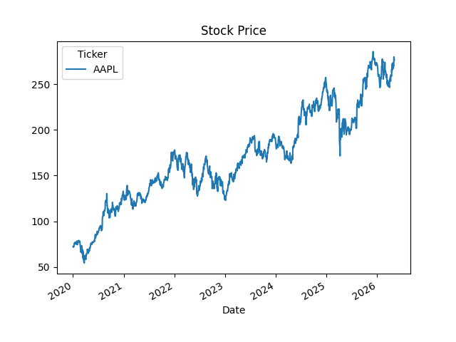
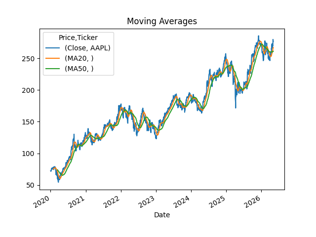
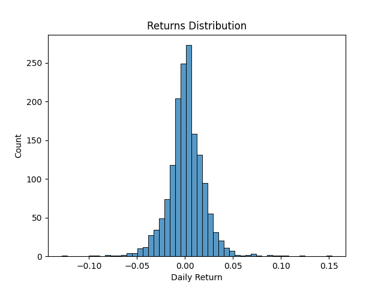

# 📈 Stock Market Data Analyzer

A complete **Python-based financial data analysis system** that fetches real-time stock market data, performs technical analysis, and generates actionable insights through visualizations and reports.

---

## 🚀 Overview

The **Stock Market Data Analyzer** is designed to simulate how analysts and fintech systems process market data.
It automates the workflow of **data collection → analysis → visualization → reporting**, helping users understand stock performance and trends.

---

## 🎯 Problem Statement

Manual stock analysis is:

* Time-consuming
* Error-prone
* Hard to scale

This project solves that by:

* Automating data analysis
* Providing visual insights
* Generating structured reports

---

## 💡 Key Features

* 📥 Fetch real-time stock data using Yahoo Finance
* 🧹 Clean and preprocess data
* 📊 Calculate daily returns
* 📈 Compute moving averages (MA20, MA50)
* ⚠️ Analyze volatility (risk measurement)
* 📉 Generate trend and distribution charts
* 📄 Create summary reports

---

## 🏗️ Project Architecture

```
Stock Data → Data Cleaning → Analysis → Indicators → Visualization → Report
```

---

## 🛠️ Tech Stack

* Python
* Pandas
* NumPy
* Matplotlib
* Seaborn
* yfinance

---

## 📁 Project Structure

```
Stock-Market-Data-Analyzer/
│
├── data/
├── notebooks/
├── src/
├── images/
├── outputs/
├── reports/
├── docs/
├── README.md
├── requirements.txt
├── .gitignore
└── main.py
```

---

## ⚙️ Installation

```
python -m venv venv
venv\Scripts\activate

pip install -r requirements.txt
```

---

## ▶️ How to Run

```
python main.py
```

---
## 📊 Output
### 📈 Charts (stored in `images/` folder)

#### 📊 Stock Price Chart



#### 📈 Moving Average Chart



#### 📉 Returns Distribution




---

## 🧪 Example Insights

* Identifies stock trends using moving averages
* Measures risk using volatility
* Shows performance using daily returns

---

## 🌍 Industry Relevance

This project reflects real-world workflows used in:

* FinTech companies
* Investment firms
* Trading platforms
* Data analytics teams

---

## 📚 Learning Outcomes

* Time-series data analysis
* Financial data processing
* Data visualization
* Python project structuring
* Real-world problem solving

---

## 🚀 Future Improvements

* Add machine learning prediction models
* Build a Streamlit dashboard
* Create FastAPI backend
* Implement stock alerts system
* Add portfolio tracking

---

## ⚠️ Disclaimer

This project is for **educational purposes only** and **does not provide financial advice**.
Do not use it for real investment decisions.

---

## 👩‍💻 Author

**Ananya Jain**
